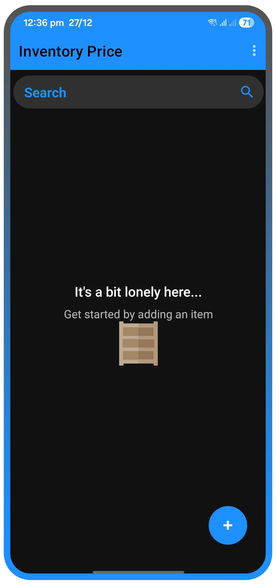
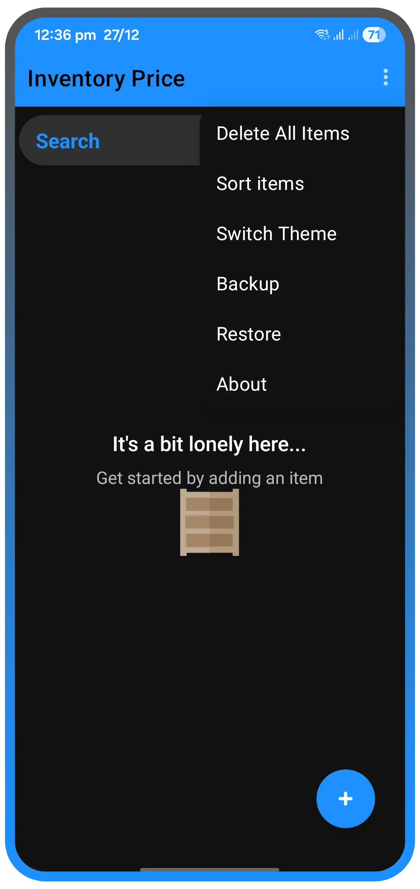
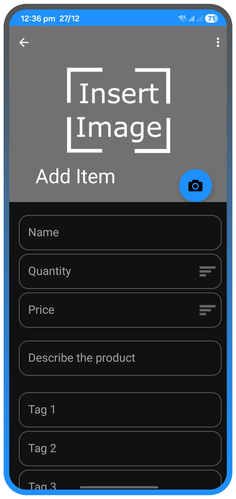
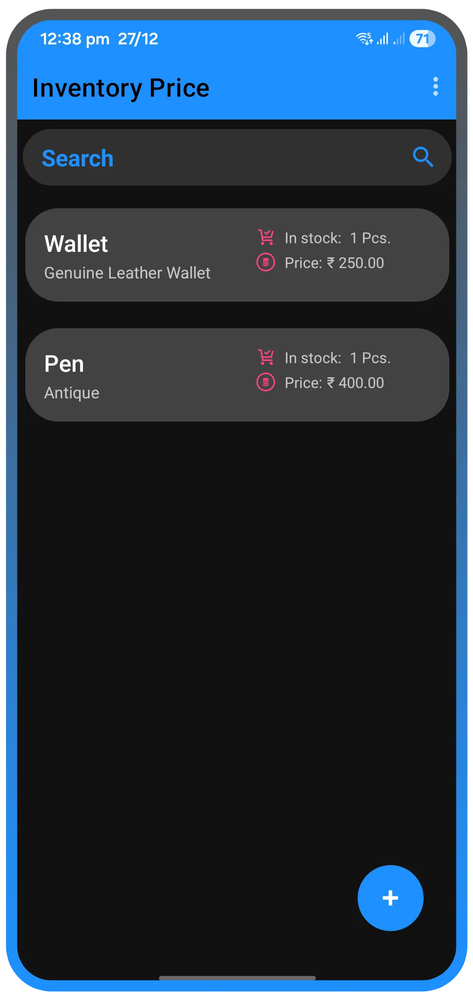
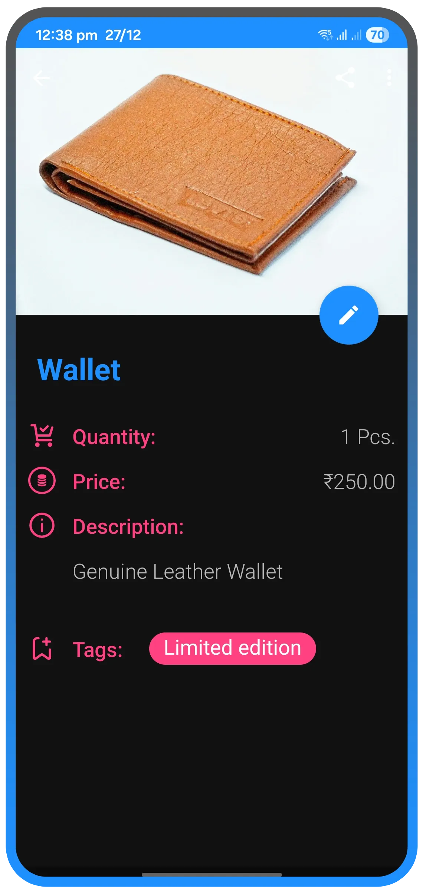
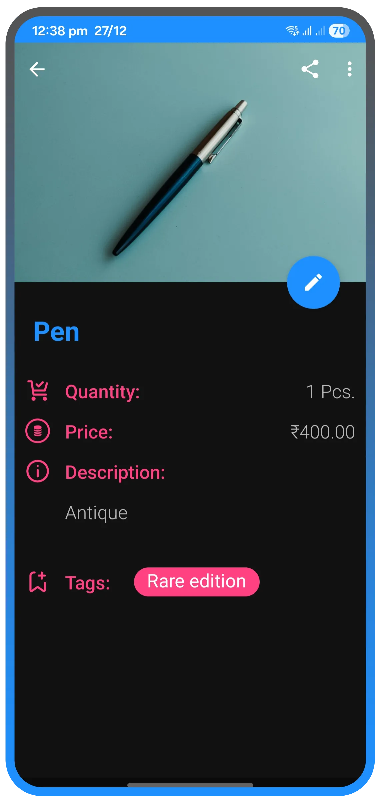
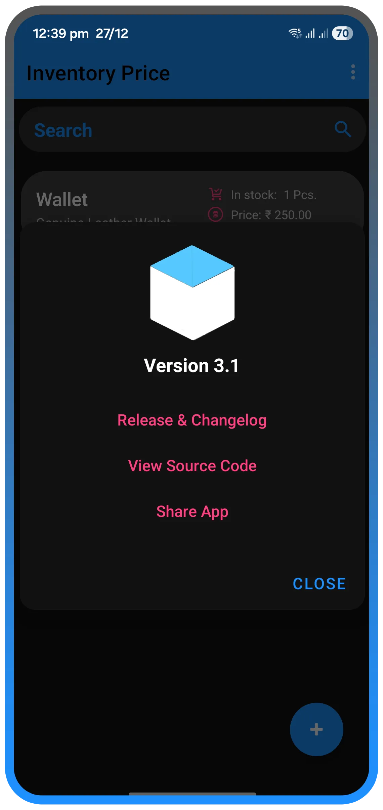

# 📦 Inventory Price

**Inventory Price** is a lightweight, intuitive mobile application designed specifically for small shopkeepers. In the fast-paced environment of retail, searching through physical ledgers to find the purchase price of an item can lead to delays and lost profits. This app eliminates that hassle by providing instant access to product data so you can sell with confidence.

# 🖼️ Screenshots

<b>Click to view Screenshots:</b>

 

  
  
   
  
  
   
  
  
   
  
  

---

## ✨ Key Features

### 🔍 Powerful Search
Stop flipping through pages. Find your products instantly by searching via:
* **Product Name**
* **Description**
* **Tags**
* *Tip: You don't even need to type the full name—partial keywords will bring up the results you need.*

### 📸 Visual Inventory
**NEW:** Never forget what a product looks like. You can now attach product images directly using your device's camera during entry.

### ↕️ Smart Sorting
Organize your inventory the way you want. You can sort products by:
* **Alphabetical Order** (Name)
* **Price** (Low to High)
* **Default** (Based on entry order)

### 🎨 Material Design
Built with a focus on user experience. The **Material Design** interface makes manipulating your database intuitive. From the color scheme to the iconography, everything is designed to make updating your records quick, easy, and unintimidating.

### 🌓 Theme Support
Whether you are working in a bright shop or a dim warehouse, we’ve got you covered:
* **Light Mode**
* **Dark Mode**
* **System Default** (Automatically adapts to your phone settings)

### 💾 Backup & Restore
Never worry about losing your data.
* **Backup:** With one tap, export your entire product list to `Download > App_Folder`.
* **Restore:** Easily move your data if you change phones or reinstall the app. No manual re-entry required!

### 🛠 Installation
Check the latest release to download the APK file:
👉 [Download Inventory Price APK](https://github.com/mukesh22584/Inventory_Price/releases)

---

### 🙏 Credits
**This app is a proud fork of the [Inventory app](https://github.com/gerin98/Inventory) by gerin98. We thank them for their excellent open-source work.**

---

## 📄 License
This project is licensed under the MIT License - see the [LICENSE](./LICENSE.txt) file for details.
